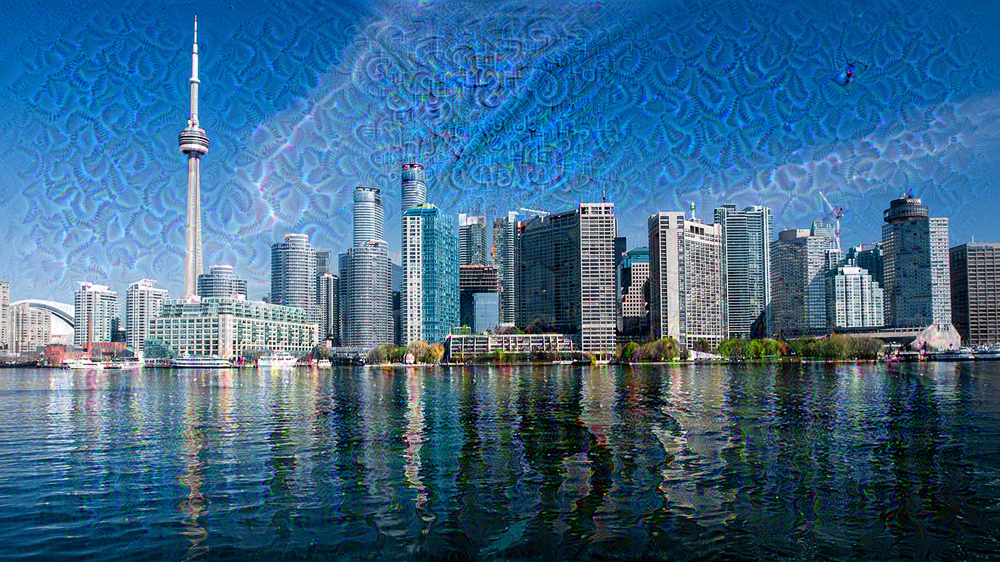

# Dream Image Generation Project

This project demonstrates the generation of dream-like images using a pre-trained InceptionV3 model in TensorFlow. The process involves optimizing an input image to maximize certain features at different layers of the neural network, resulting in visually striking and surreal images.

## Introduction

In this project, we explore the fascinating process of generating dream-like images using deep neural networks. We utilize a pre-trained InceptionV3 model, which is known for its ability to extract rich and complex features from images. By applying gradient ascent techniques, we manipulate the input image to amplify certain features, resulting in visually captivating dream images.

## Base Image

We start with a base image, which serves as the foundation for generating the dream images. This image can be any photograph or artwork that we wish to transform into a dream-like visualization.

## Feature Extraction

Using the InceptionV3 model, we extract features from the base image at different layers of the neural network. These features capture various visual patterns and textures present in the image.

## Gradient Ascent

Next, we apply gradient ascent techniques to iteratively adjust the input image to maximize certain features. By optimizing the image in this way, we enhance specific visual elements, creating surreal and abstract interpretations of the original image.

## Dream Image Generation

The main process involves applying gradient ascent at different scales of the image, known as octaves. This multi-scale approach allows us to capture both fine details and broader patterns in the dream images.

## Conclusion

In conclusion, this project showcases the creative potential of neural networks in generating artistic and imaginative visualizations. By manipulating the feature space of an input image, we can transform ordinary photographs into captivating dream-like compositions, opening up new avenues for artistic expression and exploration.
